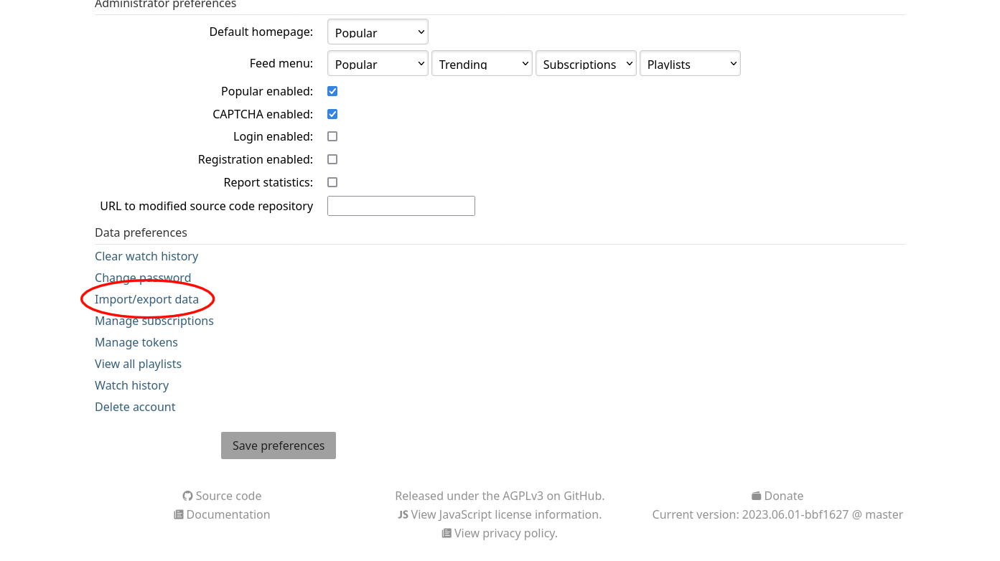
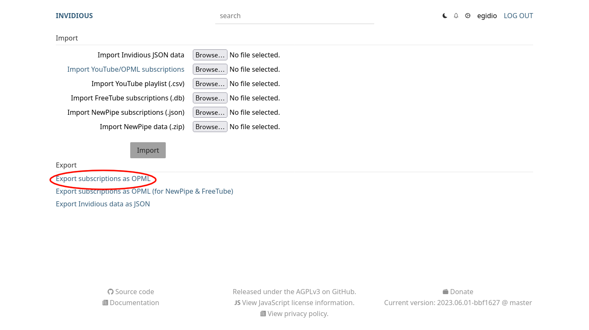
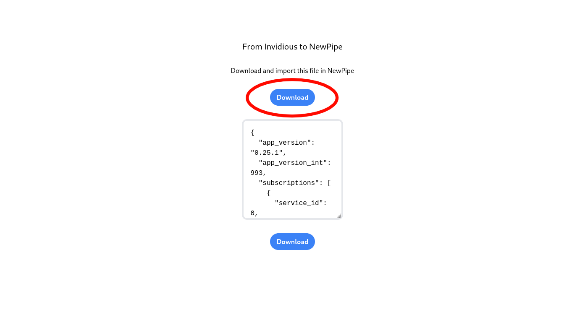

# NewPipe Subscriptions

This is a web application for importing subscriptions into your favourite YouTube client.

> At the moment only Invidious is supported. If you need to convert a file exported from another platform, please [open a issue](https://github.com/EgidioCaprino/newpipe-subscriptions/issues/new).

## How it works

1. Go to your Invidious settings and click on `Import/export data`.

2. Click on `Export subscriptions as OPML`.

3. Go to [https://newpipe-subscriptions.vercel.app/](https://newpipe-subscriptions.vercel.app/).

4. Upload the file you exported from Invidious.

5. Download the converted file.

6. Import that file in NewPipe.
